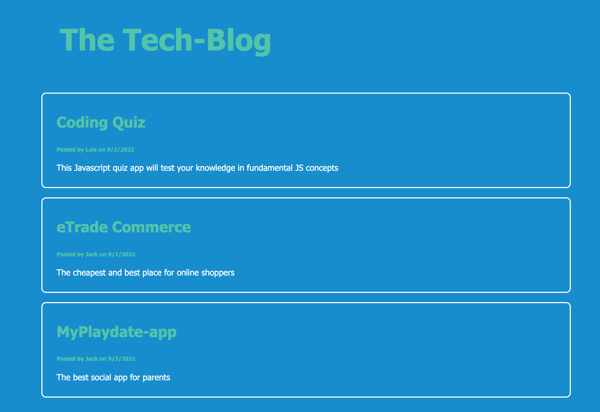

# Homework-14-TechBlog

## Overview

This CMS-style blog site allows developers to publish their blog posts and comment on other developers’ posts as well and has been built to follow the MVC paradigm in its architectural structure.

This project uses Handlebars.js as the templating language, Sequelize as the ORM, and the express-session npm package for authentication.

## Screen layout and Design

The following image depicts the web application's appearance and functionality:

## Installation

For this app, is neccesary to execute the following steps:

- Create a repository
- Clone the project repository using git clone
- Initialise the project using command: git init
- Create package JSON file using npm init
- Install npm dependencies
- Create MySQL database

## Deployment

### Github Repository

https://github.com/LuisBonilla89/Homework-14-TechBlog

### Heroku Link:
